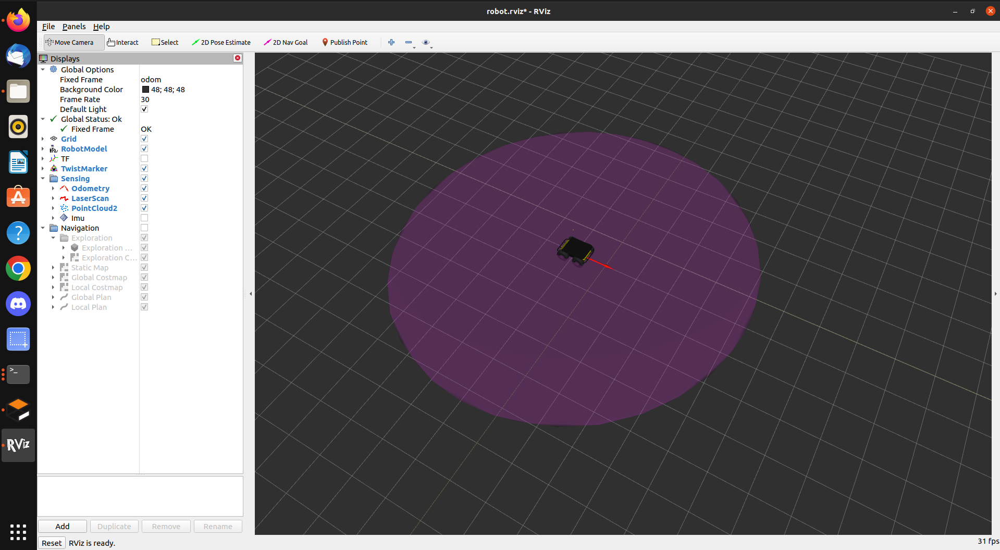

# UAV-UGV
## California State Polytechnic University: 
Unmanned Ariel Vehicle and Unmanned Ground Vehicle collaboration 

### ROS Installation
**Tested on ubuntu 20.04 and ros-noetic* 

Start by cloning the repo into your documents folder.

From a terminal, navigate to the UAV-UGV directory and run the following command:
```
sh ROS_installer.sh
```
When prompted, provide the install sctipt with the version of ROS that you wish to install. (noetic in this case).
Provide 'y' to the terminal if prompted to do so. The installation should take about 5 minutes.

** Note that while melodic and kinetic can be used, we have had issues running simulations with these versions.


You can check that the installation was successful by launching the master node. Run the command
```
roscore
```
and verify that no errors occur.

### Catkin Workspace
Now that ROS is installed, you can create a workspace that you will use to store your programs and manage your packages.
To do so, run the command
```
sh workspace_generator.sh
```
When prompted, provide the script with a name for your workspace (test_workspace in this case). We recommend using only one workspace 
per installatoin. If successful, you should see a folder appear in your home directory with the workspace name you provided.


### HUSKY-A200 Installation
Now you may install the packages needed to run simulations involving the husky-a200. Run the command 

```
sh HUSKY_installer.sh
```
and provide the version of your ros installation.


When the installation is complete, three separate terminals should open automatically: ros-master, gazebo, and rviz.


If everything is successful, you should have two separate windows open. One for <b>GAZEBO</b>
and one for <b>RVIZ</b>.

If the installation was not successful, run the script a second time. Sometimes gazebo takes too long to load for rviz.
and the models will load without textures. If this is the case, run the commands manually.

```
roslaunch husky_gazebo husky_empty_world.launch
```

```
roslaunch husky_viz view_robot.launch
```



*Note that above commands should auto-tab complete after typing <i>roslaunch hu</i>

If this is not the case, source the setup file in the catkin workspace

```
source ~/catkin_ws/devel/setup.bash
```